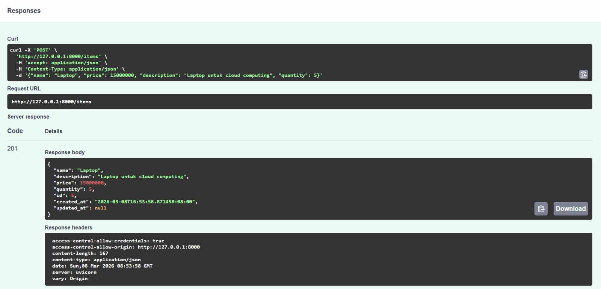
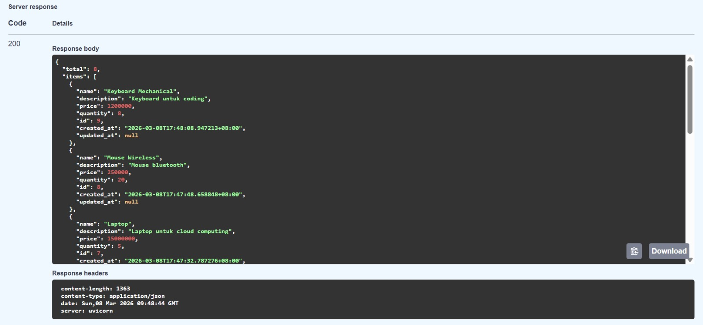
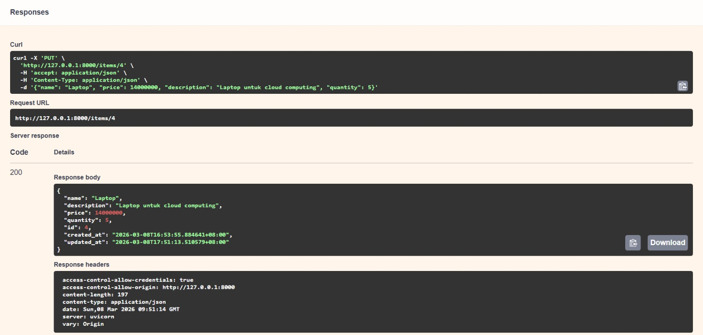
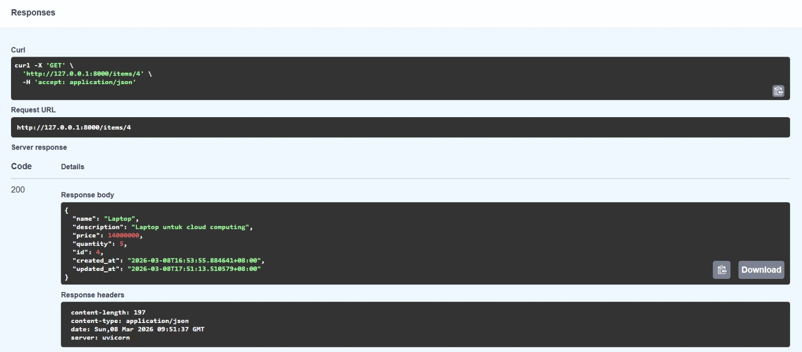
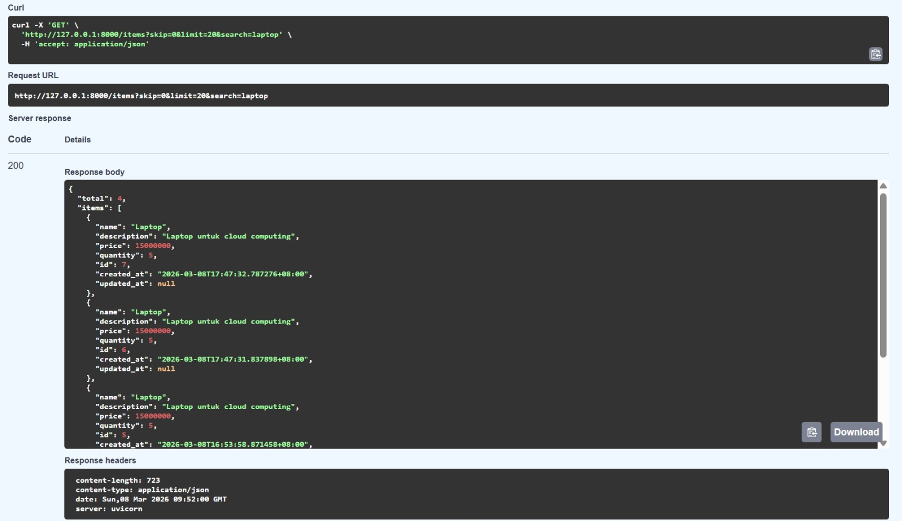
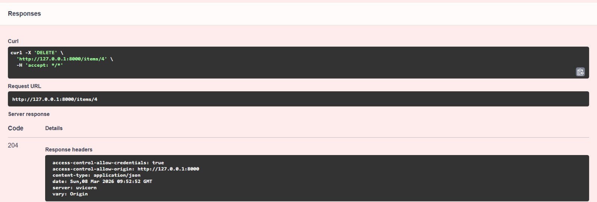
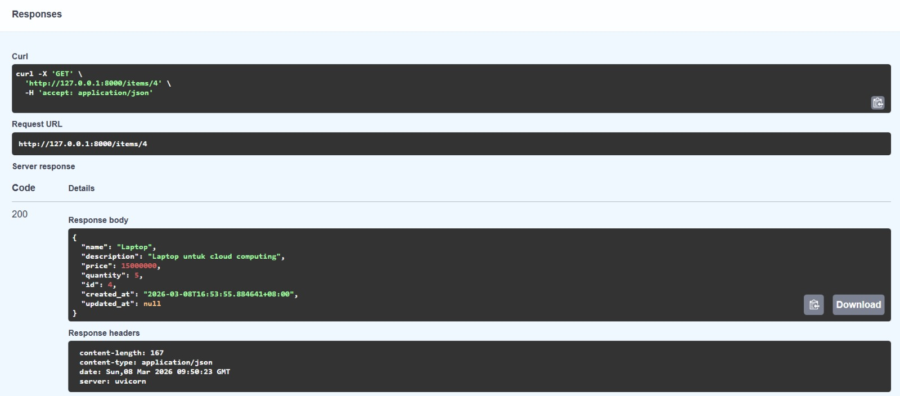

# Hasil Test API #

**POST/Items**

Gambar diatas menunjukan hasil penambahan items, yaitu
- name items : "Laptop"
- deskription : "Laptop untuk cloud computing"
- price/harga : "15000000
- quantity/stok : 5

---

**GET/Items**

Gambar diatas menunjukan Pengambilan data dilakukan terhadap item yang telah diinputkan. Tampilan tersebut menunjukkan bahwa item-item yang telah didaftarkan berhasil tersimpan di dalam database, dan data tersebut akan ditampilkan saat query `GET` dijalankan.

---

**GET/Items/4 - item laptop**

Endpoint GET /items/4 digunakan untuk menampilkan data item berdasarkan ID tertentu. Pada tampilan di atas, sistem menjalankan perintah untuk mengambil data item dengan ID ‘4’, sehingga data yang ditampilkan adalah laptop yang memiliki ID tersebut dari database.

---

**PUT/Items/4 - Update harga laptop**

Gambar diatas menunjukan proses untuk memperbarui data item.  Data yang diperbarui yaitu harga laptop yang awalnya '15000000' menjadi '14000000'

---

**GET/Items/4 - update harga laptop**

Gambar diatas menunjukan, database berhasil menyimpan hasil update harga laptop menjadi '14000000' 

---

**GET/Items/Search=laptop**

Gambar diatas menunjukan proses yang dilakukan untuk menampilkan data harga laptop yang telah diupdate.

---

**DELET/Items/4**

Gambar diatas menunjukan proses penghapusan items laptop dengan id '4' dengan pernitah 'DELET'

---

**GET/items/4 - Response 404**

Gambar diatas menunjukan kode status '404' yang menandakan bahwa data item yang telah dihapus sudah tidak ada lagi didalam database.