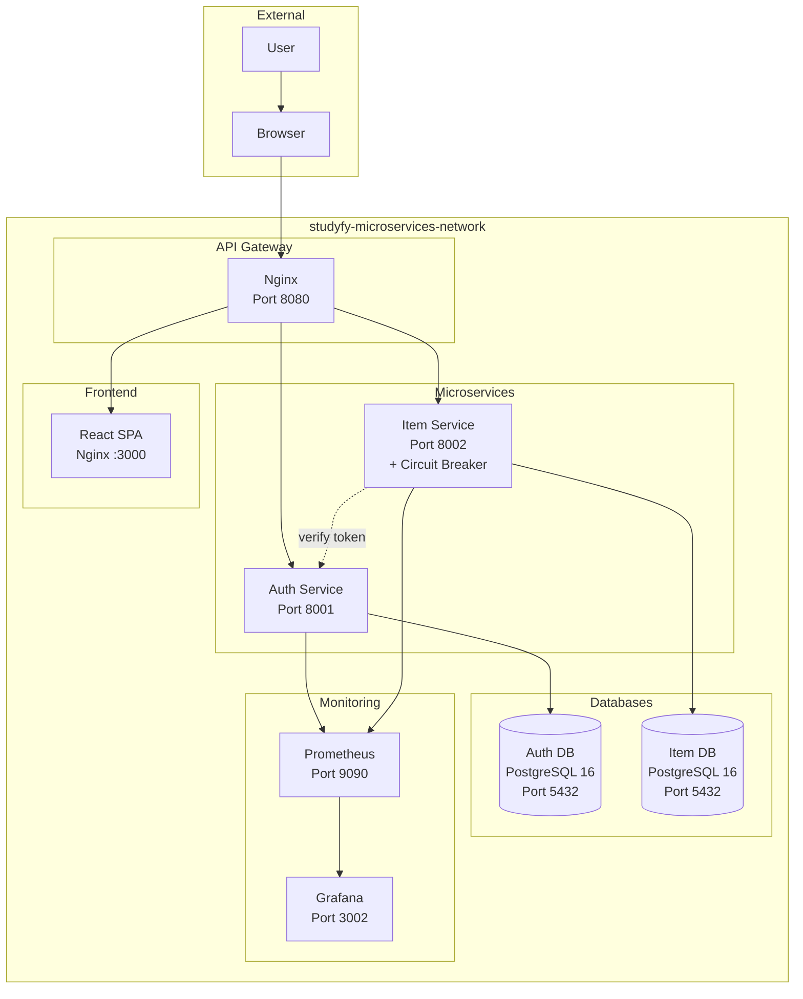
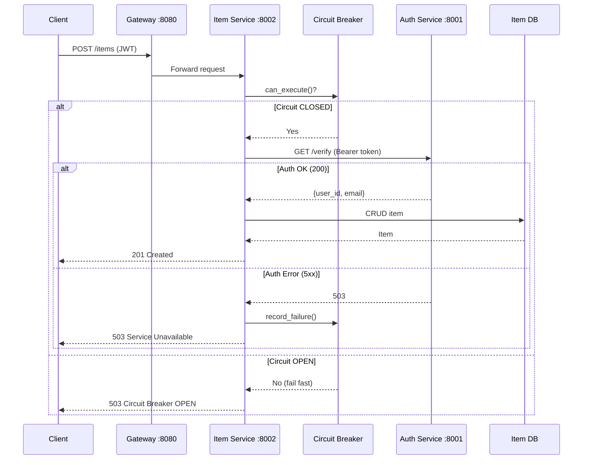
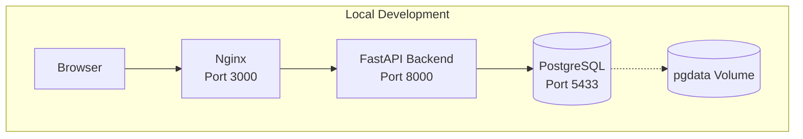

# Architecture Guide — Studyfy

> **Mata Kuliah:** Komputasi Awan — Sistem Informasi ITK  
> **Fase:** Microservices (Minggu 12-14)

Dokumentasi arsitektur sistem **Studyfy** — diagram komponen, daftar services, API contract, data model, cara deploy, dan monitoring.

---

## Daftar Isi
1. [Arsitektur Overview](#arsitektur-overview)
2. [Dual-Mode Architecture](#dual-mode-architecture)
3. [Diagram Arsitektur](#diagram-arsitektur)
4. [Microservices Cluster](#microservices-cluster)
5. [API Contract](#api-contract)
6. [Data Model](#data-model)
7. [Cara Deploy](#cara-deploy)
8. [Monitoring](#monitoring)
9. [Environment Variables](#environment-variables)
10. [CI/CD Pipeline](#cicd-pipeline)

---

## Arsitektur Overview

Studyfy menggunakan **dual-mode architecture** — dapat berjalan sebagai modular monolith maupun microservices cluster penuh.

| Mode | File | Services | Tujuan |
|------|------|----------|--------|
| **Monolith** | `docker-compose.yml` | db, backend, frontend | Development lokal cepat |
| **Microservices** | `docker-compose.microservices.yml` | auth-db, item-db, auth-service, item-service, gateway, frontend, prometheus, grafana | UAS / Production |
| **Production** | `docker-compose.prod.yml` | auth-db, item-db, auth-service, item-service, gateway, frontend | Production deploy |
| **Dev overrides** | `docker-compose.dev.yml` | Hot-reload untuk auth-service, item-service, frontend | Development |

### Stack

| Layer | Teknologi |
|-------|-----------|
| Frontend | React (Vite) + Nginx |
| Backend (Monolith) | Python 3.12, FastAPI, Uvicorn (port 8000) |
| Auth Service | Python 3.12, FastAPI (port 8001) |
| Item Service | Python 3.12, FastAPI (port 8002) |
| API Gateway | Nginx (port 8080 / 80) |
| Database | PostgreSQL 16 Alpine |
| ORM | SQLAlchemy 2.x |
| Auth | JWT (python-jose) + bcrypt (passlib) |
| Monitoring | Prometheus + Grafana |
| Container | Docker & Docker Compose |
| CI/CD | GitHub Actions |

### Key Features

| Feature | Implementasi | File |
|---------|-------------|------|
| Circuit Breaker | Item Service → Auth Service calls | `services/item-service/circuit_breaker.py` |
| Structured Logging | JSON format, correlation ID | `services/shared/logging_config.py` |
| Request Logging | Timing, status, error rate alerting | `services/shared/logging_middleware.py` |
| Metrics | In-memory collector, sliding window | `services/shared/metrics.py` |
| Health Checks | Setiap service + container healthcheck | Semua service |
| Resource Limits | CPU & memory limits per container | `docker-compose.microservices.yml` |
| Retry Logic | 3 retry dengan exponential backoff | `services/item-service/auth_client.py` |

---

## Dual-Mode Architecture

### Mode 1: Modular Monolith

Satu aplikasi FastAPI (`backend/main.py`) menangani semua endpoint. Cocok untuk development cepat.

```
Browser → Nginx :3000 → FastAPI :8000 → PostgreSQL :5433
```

### Mode 2: Microservices Cluster

Service dipisah menjadi microservices dengan API Gateway sebagai single entry point.

```
Browser → Gateway Nginx :8080
              ├── /auth/*    → Auth Service :8001 → auth-db :5432
              ├── /items/*   → Item Service :8002 → item-db :5432
              ├── /health    → Gateway (langsung)
              └── /*         → Frontend :3000
```

---

## Diagram Arsitektur

### Microservices Architecture



### Request Flow with Circuit Breaker



### Monolith Architecture



---

## Microservices Cluster

### Services & Ports

| Service | Container | Port (Host) | Port (Container) | Network |
|---------|-----------|-------------|------------------|---------|
| **API Gateway** | `studyfy-nginx-gateway` | `8080` | `80` | studyfy-mesh |
| **Auth Service** | `studyfy-auth-service` | - | `8001` | studyfy-mesh |
| **Item Service** | `studyfy-item-service` | - | `8002` | studyfy-mesh |
| **Auth DB** | `studyfy-auth-db` | - | `5432` | studyfy-mesh |
| **Item DB** | `studyfy-item-db` | - | `5432` | studyfy-mesh |
| **Frontend** | `studyfy-frontend` | - | `80` | studyfy-mesh |
| **Prometheus** | `studyfy-prometheus` | `9090` | `9090` | studyfy-mesh |
| **Grafana** | `studyfy-grafana` | `3002` | `3000` | studyfy-mesh |

### Resource Limits

| Service | CPU Limit | Memory Limit | Restart |
|---------|-----------|-------------|---------|
| auth-db | 0.5 | 512M | unless-stopped |
| item-db | 0.5 | 512M | unless-stopped |
| auth-service | 0.25 | 256M | unless-stopped |
| item-service | 0.25 | 256M | unless-stopped |
| frontend | 0.25 | 256M | unless-stopped |
| gateway | 0.1 | 256M | unless-stopped |

### Logging

Format: **JSON structured logging** via `services/shared/logging_config.py`

Setiap log entry memiliki:
- `timestamp` — ISO 8601 UTC
- `level` — DEBUG/INFO/WARNING/ERROR/CRITICAL
- `service` — nama service (via env `SERVICE_NAME`)
- `message` — pesan log
- `correlation_id` — UUID untuk tracking request antar service
- `method`, `path`, `status_code`, `duration_ms` — untuk request logs
- `alert: true` — jika error rate > 10% dalam 1 menit

### Circuit Breaker

**File:** `services/item-service/circuit_breaker.py`

| State | Behavior | Recovery |
|-------|----------|----------|
| **CLOSED** | Request normal ke Auth Service | - |
| **OPEN** | Fail fast — langsung return 503 | Cooldown 30s, lalu HALF_OPEN |
| **HALF_OPEN** | 1 request diizinkan sebagai test | Success → CLOSED, Fail → OPEN |

**Config:**
- `failure_threshold`: 5 (kegagalan berturut-turut sebelum OPEN)
- `cooldown_seconds`: 30 (waktu tunggu sebelum HALF_OPEN)

### Retry Logic

**File:** `services/item-service/auth_client.py`

- Max retries: 3
- Base delay: 0.5s
- Backoff: exponential (0.5s, 1s, 2s)
- Timeout per request: 5s
- Retryable status codes: 500, 502, 503, 504

---

## API Contract

### Backend (Monolith Mode) — `backend/main.py`

| Method | Endpoint | Auth | Role | Fungsi |
|--------|----------|------|------|--------|
| GET | `/health` | - | - | Health check |
| POST | `/auth/register` | - | - | Register user |
| POST | `/auth/login` | - | - | Login |
| GET | `/auth/me` | JWT | - | Profile saya |
| POST | `/auth/password-reset-request` | - | - | Request reset password |
| POST | `/auth/password-reset-verify` | - | - | Verify & reset password |
| GET | `/users` | JWT | dosen/admin | List users |
| GET | `/users/profile/{user_id}` | JWT | - | Profile user |
| PUT | `/users/profile` | JWT | - | Update profile sendiri |
| GET | `/users/{user_id}/classes` | JWT | - | Classes user |
| POST | `/classes` | JWT | dosen | Buat class |
| GET | `/classes` | JWT | - | List classes (filter) |
| GET | `/classes/{class_id}` | JWT | - | Detail class |
| PUT | `/classes/{class_id}` | JWT | dosen | Update class |
| DELETE | `/classes/{class_id}` | JWT | dosen | Hapus class |
| PATCH | `/classes/{class_id}/archive` | JWT | dosen | Archive |
| PATCH | `/classes/{class_id}/unarchive` | JWT | dosen | Unarchive |
| POST | `/classes/{class_id}/students/{user_id}` | JWT | dosen | Tambah student |
| DELETE | `/classes/{class_id}/students/{user_id}` | JWT | dosen | Hapus student |
| GET | `/classes/{class_id}/students` | JWT | - | List students |
| POST | `/classes/{class_id}/materials` | JWT | dosen | Upload materi |
| GET | `/classes/{class_id}/materials` | JWT | - | List materi |
| GET | `/classes/{class_id}/materials/{material_id}` | JWT | - | Detail materi |
| PUT | `/classes/{class_id}/materials/{material_id}` | JWT | dosen | Update materi |
| DELETE | `/classes/{class_id}/materials/{material_id}` | JWT | dosen | Hapus materi |
| POST | `/classes/{class_id}/assignments` | JWT | dosen | Buat assignment |
| GET | `/classes/{class_id}/assignments` | JWT | - | List assignments |
| GET | `/classes/{class_id}/assignments/{assignment_id}` | JWT | - | Detail assignment |
| PUT | `/classes/{class_id}/assignments/{assignment_id}` | JWT | dosen | Update assignment |
| DELETE | `/classes/{class_id}/assignments/{assignment_id}` | JWT | dosen | Hapus assignment |
| POST | `/classes/{class_id}/assignments/{assignment_id}/submissions` | JWT | mahasiswa | Submit (PDF, max 2MB) |
| GET | `/classes/{class_id}/assignments/{assignment_id}/submissions` | JWT | dosen | List submissions |
| GET | `/classes/{class_id}/assignments/{assignment_id}/my-submission` | JWT | - | Submission saya + grade |
| GET | `/submissions/{submission_id}` | JWT | - | Detail submission |
| DELETE | `/submissions/{submission_id}/return` | JWT | dosen | Return submission |
| POST | `/submissions/{submission_id}/grade` | JWT | dosen | Grade submission |
| GET | `/submissions/{submission_id}/grade` | JWT | - | Lihat grade |
| POST | `/items` | JWT | - | Buat item |
| GET | `/items` | JWT | - | List items (search, category) |
| GET | `/items/stats` | JWT | - | Item statistics |
| GET | `/items/{item_id}` | JWT | - | Detail item |
| PUT | `/items/{item_id}` | JWT | - | Update item |
| DELETE | `/items/{item_id}` | JWT | - | Hapus item |
| GET | `/team` | - | - | Info tim |

### Auth Service (Microservices Mode) — `services/auth-service/main.py`

| Method | Endpoint | Auth | Fungsi |
|--------|----------|------|--------|
| GET | `/health` | - | Health check |
| GET | `/metrics` | - | Metrics |
| POST | `/register` | - | Register user |
| POST | `/login` | - | Login, return JWT |
| GET | `/verify` | Bearer | Verify token (dipanggil service lain) |

### Item Service (Microservices Mode) — `services/item-service/main.py`

| Method | Endpoint | Auth | Fungsi |
|--------|----------|------|--------|
| GET | `/health` | - | Health check (include CB status) |
| GET | `/metrics` | - | Metrics |
| POST | `/items` | JWT | Buat item |
| GET | `/items` | JWT | List items (search, pagination) |
| GET | `/items/stats` | JWT | Item statistics |
| GET | `/items/{item_id}` | JWT | Detail item |
| PUT | `/items/{item_id}` | JWT | Update item |
| DELETE | `/items/{item_id}` | JWT | Hapus item |

### Gateway Routes

**File:** `services/gateway/nginx.conf`

| Path | Target | Description |
|------|--------|-------------|
| `/auth/` | `auth-service:8001` | Auth endpoints |
| `/items` | `item-service:8002/items` | Item endpoints |
| `/health` | Gateway langsung | Health check aggregator |
| `/` | `frontend:3000` | Static files / SPA |

### Health Check Responses

**Gateway:**
```json
{"status": "healthy", "service": "gateway"}
```

**Auth Service:**
```json
{"status": "healthy", "service": "auth-service", "version": "2.0.0"}
```

**Item Service (normal):**
```json
{
  "status": "healthy",
  "service": "item-service",
  "version": "2.1.0",
  "dependencies": {
    "auth-service": {
      "state": "CLOSED",
      "failure_count": 0,
      "total_rejected": 0
    }
  }
}
```

**Item Service (degraded):**
```json
{
  "status": "degraded",
  "service": "item-service",
  "version": "2.1.0",
  "dependencies": {
    "auth-service": {
      "state": "OPEN",
      "failure_count": 5,
      "total_rejected": 10
    }
  }
}
```

---

## Data Model

**Monolith mode:** Semua tabel di satu database `studyfy` (PostgreSQL)
**Microservices mode:** Tabel terpisah per service
- `auth_db` — users, classes, materials, assignments, submissions, grades
- `item_db` — items

```mermaid
erDiagram
    User ||--o{ Class : "mengelola"
    User }o--o{ Class : "terdaftar"
    User ||--o{ Material : "mengupload"
    User ||--o{ Assignment : "membuat"
    User ||--o{ Submission : "mengirim"
    User ||--o{ Grade : "menilai"
    Class ||--o{ Material : "memiliki"
    Class ||--o{ Assignment : "memiliki"
    Assignment ||--o{ Submission : "menerima"
    Submission ||--o| Grade : "dinilai"

    User { int id PK; string email UK; string name; string hashed_password; enum role; int semester }
    Class { int id PK; string name; string code UK; int instructor_id FK; int semester; string academic_year; int max_students; bool is_archived }
    Material { int id PK; int class_id FK; string title; enum type "pdf|ppt|video|link"; string file_path; int uploaded_by FK }
    Assignment { int id PK; int class_id FK; string title; datetime deadline; bool allow_late; int max_score; int created_by FK }
    Submission { int id PK; int assignment_id FK; int student_id FK; string file_path; int file_size; bool is_late }
    Grade { int id PK; int submission_id FK UK; float score; int graded_by FK }
    Item { int id PK; string name; float price; int quantity; string category; int owner_id FK }
```

---

## Cara Deploy

### Mode Monolith (Development)

```bash
docker compose up -d
# Backend: http://localhost:8000
# Frontend: http://localhost:3000
```

### Mode Microservices (UAS / Production)

```bash
docker compose -f docker-compose.microservices.yml up -d --build
# Gateway: http://localhost:8080
# Grafana: http://localhost:3002
# Prometheus: http://localhost:9090
```

### Mode Production

```bash
docker compose -f docker-compose.prod.yml up -d --build
# Gateway: http://localhost:80
```

### Dev Mode (Hot-Reload)

```bash
make dev
# atau
docker compose -f docker-compose.yml -f docker-compose.microservices.yml -f docker-compose.dev.yml up --build
```

### Makefile Commands

```bash
make up        # Start all services
make build     # Rebuild & start
make dev       # Dev mode with hot-reload
make prod      # Production mode
make down      # Stop containers
make clean     # Stop + delete volumes (data hilang!)
make logs      # Colorized logs
make ps        # Container status
make test      # Run pytest + vitest
make lint      # Run linter
make pr-check  # Lint + test + build
```

---

## Monitoring

### Prometheus

Semua service di-microservices cluster meng-expose metrics di `/metrics`:

| Metric | Description |
|--------|-------------|
| request_count | Total requests |
| error_count | Total errors (4xx + 5xx) |
| status_counts | Per-status code counter |
| latency (avg/p95/p99) | Request duration |
| error_rate_last_minute | Error rate dalam sliding window 60s |

### Grafana

Akses di `http://localhost:3002` (default: admin/admin)

Visualisasi:
- Request rate per service
- Error rate dashboard
- Circuit breaker state
- Latency distribution
- Resource usage (CPU/Memory)

### Logging

Semua service menggunakan JSON structured logging. Log dikirim ke stdout dan bisa di-collect oleh `journald` atau `fluentd`.

```json
{"timestamp": "2026-05-03T10:00:00Z", "level": "INFO", "service": "item-service", "correlation_id": "a1b2c3d4e5f6", "method": "POST", "path": "/items", "status_code": 201, "duration_ms": 45.2}
```

---

## Environment Variables

### Backend (Monolith Mode)

| Variable | Default | Description |
|----------|---------|-------------|
| `DATABASE_URL` | `sqlite:///./test.db` | Database connection |
| `SECRET_KEY` | (built-in) | JWT signing key |
| `ALGORITHM` | `HS256` | JWT algorithm |
| `ACCESS_TOKEN_EXPIRE_MINUTES` | `60` | Token expiry |
| `ALLOWED_ORIGINS` | `http://localhost:5173,http://localhost:3000` | CORS |
| `APP_ENV` | `development` | Environment mode |
| `DEBUG` | `True` (dev) / `False` (prod) | Debug mode |
| `LOG_LEVEL` | `DEBUG` (dev) / `WARNING` (prod) | Log level |

**Config class:** `backend/config.py` — `DevelopmentConfig` atau `ProductionConfig`

### Auth Service

| Variable | Default | Description |
|----------|---------|-------------|
| `DATABASE_URL` | - | PostgreSQL connection |
| `SECRET_KEY` | `dev-secret-key` | JWT signing |
| `ACCESS_TOKEN_EXPIRE_MINUTES` | `30` | Token expiry |

### Item Service

| Variable | Default | Description |
|----------|---------|-------------|
| `DATABASE_URL` | - | PostgreSQL connection |
| `AUTH_SERVICE_URL` | `http://auth-service:8001` | Auth service endpoint |

---

## CI/CD Pipeline

### GitHub Actions

**File:** `.github/workflows/ci-testing.yml` (push — build & integration test)

```yaml
- Build Docker images
- Docker Compose up
- Wait for health
- Run tests
- Docker Compose down
```

**File:** `.github/workflows/main.yml` (PR to main/develop)

```yaml
jobs:
  test-frontend:
    - npm ci
    - npm test -- --run | npm run build
  notify-failure:
    - Comment on PR if failed
```

---

*Last updated: 2026-05-03 | Lead QA & Docs*
