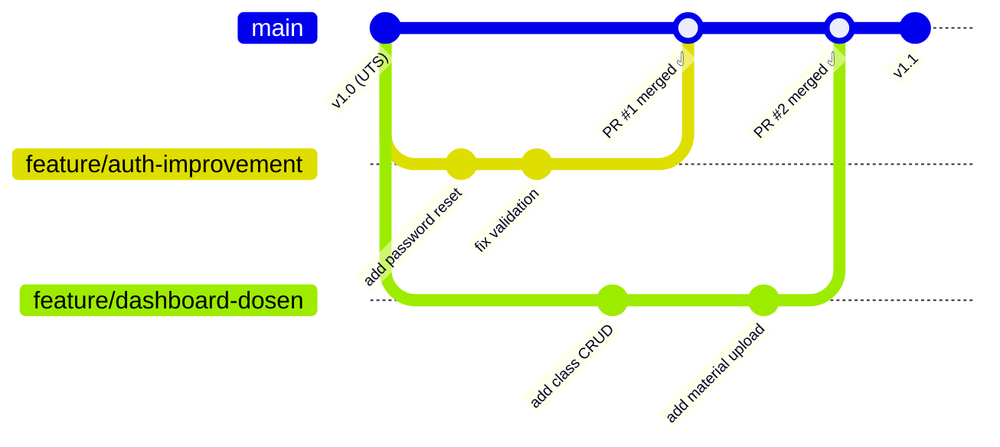

# Git Workflow Guide Studyfy
Panduan standar workflow Git untuk kolaborasi tim dalam project **Studyfy**. Panduan ini dibuat untuk memastikan konsistensi, mengurangi konflik, dan memudahkan proses review kode.

---

## 📑 Daftar Isi
1. [Branch Strategy](#-branch-strategy)
2. [Branch Naming Convention](#-branch-naming-convention)
3. [Commit Message Convention](#-commit-message-convention)
4. [Pull Request Process](#-pull-request-process)
5. [Code Review Guidelines](#-code-review-guidelines)
6. [Merge Strategy](#-merge-strategy)
7. [Handling Merge Conflicts](#-handling-merge-conflicts)
8. [CODEOWNERS & Auto Reviewers](#-codeowners--auto-reviewers)
9. [Best Practices](#-best-practices)

---

## 🌿 Branch Strategy

Project ini menggunakan **GitHub Flow** — model workflow yang sederhana dan cocok untuk tim kecil (4-5 orang) yang melakukan continuous delivery.

### Struktur Branch

| Branch | Fungsi | Protected |
|--------|--------|-----------|
| `main` | Production-ready, kode yang selalu bisa di-deploy | ✅ Ya |
| `feature/<nama>` | Fitur baru | ❌ Tidak |
| `fix/<nama>` | Perbaikan bug | ❌ Tidak |
| `docs/<nama>` | Update dokumentasi | ❌ Tidak |
| `refactor/<nama>` | Refactoring kode | ❌ Tidak |
| `chore/<nama>` | Maintenance & konfigurasi | ❌ Tidak |

> **Catatan:** Tidak ada branch `dev`. Semua pengembangan dilakukan di feature branch yang dibuat dari `main`, dan setelah review selesai langsung di-merge ke `main`.

### Aturan GitHub Flow

1. **`main` selalu deployable** — kode di `main` harus selalu dalam kondisi stabil dan siap di-deploy
2. **Buat branch dari `main`** — setiap fitur, bug fix, atau perubahan harus dimulai dari branch `main` terbaru
3. **Commit secara reguler** — lakukan commit dan push ke branch fitur secara berkala
4. **Buat Pull Request** — saat fitur siap atau membutuhkan feedback dari anggota lain
5. **Review & diskusi** — anggota lain melakukan code review sebelum memberikan approval
6. **Merge setelah approved** — setelah review selesai dan mendapat minimal 1 approval, lakukan squash merge ke `main`
7. **Hapus branch** — hapus branch fitur setelah berhasil di-merge untuk menjaga kebersihan repository

### Alur Kerja Visual



### Alur Kerja Step-by-Step

| Step | Perintah / Aksi | Keterangan |
|------|-----------------|------------|
| **1. Pull main terbaru** | `git checkout main && git pull origin main` | Pastikan branch lokal sudah sync dengan remote |
| **2. Buat branch baru** | `git checkout -b feature/nama-fitur` | Buat branch dari `main` untuk memulai pengerjaan |
| **3. Kerjakan fitur** | Edit kode, `git add`, `git commit` | Commit secara berkala di branch fitur |
| **4. Push ke GitHub** | `git push origin feature/nama-fitur` | Upload branch ke remote repository |
| **5. Buat Pull Request** | Compare & pull request di GitHub | Isi deskripsi, checklist, dan screenshot (jika ada) |
| **6. Auto-assign reviewer** | Otomatis via CODEOWNERS | Reviewer ditambahkan berdasarkan area file yang diubah |
| **7. Code review** | Review di tab "Files changed" | Reviewer beri komentar pada baris spesifik |
| **8. Perbaikan (jika perlu)** | `git push origin feature/nama-fitur` | Push fix sesuai feedback reviewer |
| **9. Approve** | "Review changes → Approve" ✅ | Reviewer menyetujui PR setelah perbaikan |
| **10. Squash & Merge** | Klik "Squash and merge" | Merge ke `main`, commit jadi satu yang rapi |
| **11. Hapus branch** | Klik "Delete branch" | Bersihkan branch yang sudah tidak diperlukan |

---

## 🏷️ Branch Naming Convention

Format: `tipe/deskripsi-singkat` (lowercase, kebab-case)

| Tipe | Kapan Digunakan | Contoh |
|------|-----------------|--------|
| `feature/` | Menambah fitur baru | `feature/user-profile` |
| `fix/` | Memperbaiki bug | `fix/login-token-expired` |
| `docs/` | Update dokumentasi | `docs/api-docs-update` |
| `refactor/` | Perbaikan kode tanpa ubah behavior | `refactor/split-crud-service` |
| `chore/` | Maintenance, config, dependencies | `chore/update-requirements` |

**Aturan:**
- Gunakan huruf kecil semua
- Pisahkan kata dengan `-` (kebab-case)
- Gunakan bahasa Inggris untuk konsistensi
- Jaga nama branch tetap singkat dan deskriptif
- Hindari nama generik seperti `fix`, `update`, `wip`

---

## 📝 Commit Message Convention

Mengikuti **Conventional Commits** specification:

```
tipe: deskripsi singkat

Body opsional: penjelasan lebih detail

Footer opsional: referensi issue
```

| Tipe | Kapan | Contoh |
|------|-------|--------|
| `feat` | Fitur baru | `feat: add user profile page` |
| `fix` | Bug fix | `fix: resolve JWT token expiry issue` |
| `docs` | Dokumentasi | `docs: update API endpoint list in README` |
| `refactor` | Refactoring | `refactor: extract auth logic to separate module` |
| `chore` | Maintenance | `chore: update python dependencies` |
| `test` | Testing | `test: add unit tests for CRUD operations` |
| `style` | Formatting | `style: fix indentation in docker-compose.yml` |

**Contoh Commit yang Baik:**
```
feat: add health check endpoint with database status

Menambahkan endpoint GET /health yang mengecek koneksi
database dan return status semua komponen sistem.
```

**Contoh Commit yang Buruk:**
```
fix bug
update
wip
```

---

## 🔀 Pull Request Process

### 1. Sebelum Membuat PR
- Pastikan kode sudah di-test dan berjalan dengan baik
- Pull `main` terbaru dan merge/rebase ke branch fitur
- Pastikan commit message sudah mengikuti convention
- Tidak ada hardcoded credentials atau secrets

### 2. Membuat PR
- Buka GitHub → **Pull requests** → **New pull request**
- Base branch: `main`
- Compare: branch fitur kamu
- Isi PR dengan lengkap:

```markdown
## Deskripsi
Jelaskan perubahan yang dilakukan dan mengapa.

## Jenis Perubahan
- [ ] ✨ Fitur baru (feature)
- [ ] 🐛 Bug fix
- [ ] 📝 Dokumentasi
- [ ] ♻️ Refactoring
- [ ] 🔧 Konfigurasi / chore

## Checklist
- [ ] Kode sudah ditest secara lokal
- [ ] Tidak ada hardcoded secrets/credentials
- [ ] Commit message mengikuti Conventional Commits
- [ ] README diupdate (jika perlu)

## Screenshot (jika ada perubahan UI)
<!-- Paste screenshot di sini -->
```

### 3. Review & Merge
- PR akan otomatis di-assign ke reviewer sesuai [CODEOWNERS](#-codeowners--auto-reviewers)
- Minimal **1 approval** sebelum bisa di-merge
- Gunakan **Squash and Merge** untuk menjaga history commit yang bersih
- Hapus branch setelah merge (klik "Delete branch")

---

## 🔍 Code Review Guidelines

### Reviewer Checklist
- [ ] Kode berfungsi sesuai deskripsi PR
- [ ] Tidak ada error atau warning baru
- [ ] Mengikuti coding style yang sudah ada
- [ ] Variable dan function naming jelas dan deskriptif
- [ ] Tidak ada hardcoded credentials atau secrets
- [ ] Error handling sudah memadai
- [ ] Dokumentasi/API comment update jika perlu

### Cara Memberikan Review
- **Approve** ✅ — kode sudah siap merge
- **Request Changes** ❌ — perlu perbaikan (jelaskan spesifik)
- **Comment** 💬 — pertanyaan atau saran non-blocking

**Contoh Review yang Baik:**
```
✅ Logic CRUD sudah bagus dan mengikuti pattern yang ada.

💡 Saran:
- Tambahkan validasi max_students > 0 di schema
- Pertimbangkan pagination untuk list materials

🔍 File: backend/schemas.py, line 45
```

**Contoh Review yang Buruk:**
```
❌ "Kodenya salah" — tidak jelaskan apa yang salah
❌ "LGTM" — tanpa benar-benar membaca kode
❌ "..." — komentar kosong, tidak bermakna
```

### Tips Code Review
- Berikan feedback yang konstruktif, bukan menghakimi
- Jelaskan **mengapa**, bukan hanya "salah"
- Puji kode yang bagus — review bukan hanya soal menemukan kesalahan
- Gunakan fitur "suggestion" di GitHub untuk menyarankan perubahan langsung

---

## 🔗 Merge Strategy

### Opsi yang Tersedia

| Strategy | History | Kapan Digunakan |
|----------|---------|-----------------|
| **Merge commit** | Semua commit + merge commit | Fitur besar, perlu traceability detail |
| **Squash & merge** | Satu commit bersih | **Default** — fitur kecil, banyak commit WIP |
| **Rebase & merge** | Linear, tanpa merge commit | Tim yang suka history rapi |

### Keputusan Tim

**Default: Squash & Merge**

Alasan:
- History `main` tetap bersih (1 commit per fitur)
- Mudah di-revert jika ada masalah
- Commit message PR bisa diedit saat squash untuk memberikan konteks yang lebih baik

---

## ⚠️ Handling Merge Conflicts

### Apa itu Merge Conflict?

Merge conflict terjadi saat **dua branch mengubah baris yang sama** di file yang sama. Git tidak bisa memutuskan versi mana yang benar.

### Langkah Resolve Conflict

**1. Update branch dengan main terbaru**
```bash
git checkout feature/nama-branch
git fetch origin
git merge origin/main
# ⚠️ CONFLICT muncul!
```

**2. Buka file yang conflict**
```
<<<<<<< HEAD
Versi kode dari branch kamu
=======
Versi kode dari main
>>>>>>> origin/main
```

Tiga bagian:
- `<<<<<<< HEAD` sampai `=======` → **versi branch kamu**
- `=======` sampai `>>>>>>>` → **versi dari main**

**3. Pilih atau gabungkan**
Hapus marker dan tulis versi final yang benar.

**4. Commit hasil resolve**
```bash
git add <file-yang-diresolve>
git commit -m "fix: resolve merge conflict in <nama-file>"
git push origin feature/nama-branch
```

PR di GitHub otomatis ter-update — conflict resolved.

### Tips Hindari Konflik
- Pull `main` secara berkala (minimal 1x sehari)
- Koordinasi dengan tim jika mengubah file yang sama
- Manfaatkan CODEOWNERS untuk menghindari edit file yang sama bersamaan
- Buat branch fitur yang fokus dan tidak terlalu luas

---

## 👥 CODEOWNERS & Auto Reviewers

File `.github/CODEOWNERS` mengatur reviewer otomatis berdasarkan file yang diubah:

| Area | Pemilik | GitHub |
|------|---------|--------|
| `/backend/` | Lead Backend | @Sourremon |
| `/frontend/` | Lead Frontend | @DhiyaAfifah-UI |
| `docker-compose.yml`, `Dockerfile`, `Makefile` | Lead DevOps | @10231041-cloud |
| `README.md`, `/docs/` | Lead QA & Docs | @ForXDis |

**Catatan:**
- Reviewer otomatis akan ditambahkan saat PR dibuat
- PR tidak bisa di-merge tanpa approval dari pemilik area terkait
- Update file CODEOWNERS jika ada perubahan tanggung jawab

---

## 💡 Best Practices

### ✅ Do
- Commit sering dengan pesan yang jelas dan deskriptif
- Pull `main` terbaru sebelum membuat PR
- Test kode secara lokal sebelum push
- Gunakan branch terpisah untuk setiap fitur/fix
- Hapus branch setelah merge
- Manfaatkan sesi praktikum untuk coding bersama
- Berikan review yang konstruktif dan substantif

### ❌ Don't
- Jangan commit atau push langsung ke `main`
- Jangan push tanpa pull `main` terbaru
- Jangan gunakan nama branch generik (`fix`, `update`, `wip`)
- Jangan commit file `.env` atau credentials
- Jangan merge PR tanpa review
- Jangan push di waktu yang sama tanpa koordinasi
- Jangan berikan review "LGTM" tanpa benar-benar membaca kode

---

*Terakhir diupdate: 2026-05-03 | Oleh: Lead QA & Docs Studyfy*
