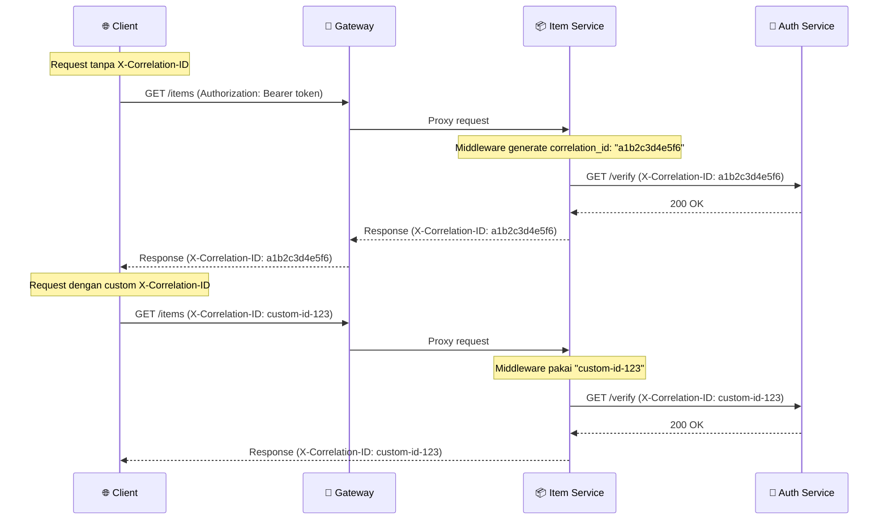

# Operations Guide — Studyfy

Panduan operasional untuk monitoring, logging, tracing, dan troubleshooting sistem **Studyfy** dalam dua mode: **Monolith** (development) dan **Microservices** (UAS/production).

---

## Daftar Isi

1. [Health Check](#health-check)
2. [Logging](#logging)
3. [Request Tracing (Correlation ID)](#request-tracing-correlation-id)
4. [Metrics & Monitoring](#metrics--monitoring)
5. [Common Troubleshooting](#common-troubleshooting)
6. [Escalation Path](#escalation-path)

---

## Health Check

Setiap service memiliki endpoint `/health` untuk mengecek status. Response dalam format JSON.

### Endpoint Health Check

| Mode | Service | Endpoint | Cara Cek |
|------|---------|----------|----------|
| Monolith | Backend | `GET /health` | `curl http://localhost:8000/health` |
| Microservices | Gateway | `GET /health` | `curl http://localhost:8080/health` |
| Microservices | Auth Service | `GET /health` | `curl http://localhost:8001/health` |
| Microservices | Item Service | `GET /health` | `curl http://localhost:8002/health` |

### Response per Service

**Backend Monolith** (`backend/main.py:61-79`)
```json
// Normal (200)
{
  "status": "healthy",
  "service": "backend",
  "version": "1.0.0",
  "database": "connected"
}

// Database down (503)
{
  "status": "unhealthy",
  "service": "backend",
  "version": "1.0.0",
  "database": "error: could not connect to server"
}
```

**Auth Service** (`services/auth-service/main.py:84-90`)
```json
// Static — selalu 200
{
  "status": "healthy",
  "service": "auth-service",
  "version": "2.0.0"
}
```

**Item Service** (`services/item-service/main.py:67-79`)
```json
// Normal, circuit breaker CLOSED (200)
{
  "status": "healthy",
  "service": "item-service",
  "version": "2.1.0",
  "dependencies": {
    "auth-service": {
      "state": "CLOSED",
      "failure_count": 0,
      "failure_threshold": 5,
      "total_rejected": 0,
      "cooldown_seconds": 30
    }
  }
}

// Auth service down, CB OPEN (200 — degraded)
{
  "status": "degraded",
  "service": "item-service",
  "version": "2.1.0",
  "dependencies": {
    "auth-service": {
      "state": "OPEN",
      "failure_count": 5,
      "failure_threshold": 5,
      "total_rejected": 3,
      "cooldown_seconds": 30
    }
  }
}
```

**Gateway** (`services/gateway/nginx.conf:31-35`)
```json
// Static — selalu 200 (tidak aggregasi health downstream)
{
  "status": "healthy",
  "service": "gateway"
}
```

### Container Healthcheck

Semua container memiliki Docker healthcheck bawaan:

```bash
# Cek status health semua container
docker compose ps

# Cek detail health satu container
docker inspect --format='{{json .State.Health}}' studyfy-backend
```

Interval healthcheck: 10-30s (tergantung service), timeout 5-10s, retries 3-5.

---

## Logging

Semua service menggunakan **structured JSON logging** via `services/shared/logging_config.py`. Log dikirim ke stdout dalam format JSON, siap di-parse oleh log aggregator (ELK, Loki, etc.).

### Format Log

```json
{
  "timestamp": "2026-06-14T10:30:00.123456",
  "level": "INFO",
  "service": "auth-service",
  "logger": "logging_middleware",
  "message": "POST /auth/login → 200 (45.23ms)",
  "correlation_id": "a1b2c3d4e5f6",
  "method": "POST",
  "path": "/auth/login",
  "status_code": 200,
  "duration_ms": 45.23
}
```

### Field Descriptions

| Field | Contoh | Deskripsi |
|-------|--------|-----------|
| `timestamp` | `2026-06-14T10:30:00.123456` | Waktu dalam UTC ISO-8601 |
| `level` | `INFO`, `WARNING`, `ERROR`, `CRITICAL` | Level log |
| `service` | `auth-service`, `item-service`, `backend` | Nama service pengirim |
| `logger` | `logging_middleware`, `auth_client` | Nama logger |
| `message` | `POST /items → 200 (12.34ms)` | Pesan log |
| `correlation_id` | `a1b2c3d4e5f6` | ID untuk tracing request antar service |
| `method` | `GET`, `POST`, `PUT`, `DELETE` | HTTP method |
| `path` | `/items`, `/auth/login` | Endpoint yang diakses |
| `status_code` | `200`, `401`, `503` | HTTP status code |
| `duration_ms` | `45.23` | Durasi request dalam milidetik |
| `alert` | `true` | Ada saat error rate > 10% dalam 1 menit |
| `exception` | `Traceback...` | Stack trace (ada saat error) |

### Cara Membaca Log

**Monolith:**
```bash
# Semua log
docker compose logs -f

# Log backend saja
docker compose logs -f backend

# 50 baris terakhir
docker compose logs -f backend --tail 50
```

**Microservices:**
```bash
# Semua log
docker compose -f docker-compose.microservices.yml logs -f

# Service spesifik
docker compose -f docker-compose.microservices.yml logs -f auth-service
docker compose -f docker-compose.microservices.yml logs -f item-service

# Makefile shortcut
make logs-backend
```

### Filter Log

**PowerShell (Windows):**
```powershell
# Cari error
docker compose logs auth-service | Select-String '"level": "ERROR"'

# Cari correlation ID tertentu
docker compose logs item-service | Select-String "a1b2c3d4e5f6"

# Cari request lambat (>1000ms)
docker compose logs item-service | Select-String '"duration_ms": 1[0-9][0-9][0-9]'

# Cari alert
docker compose logs auth-service | Select-String '"alert": true'
```

**Linux/Mac/WSL:**
```bash
# Cari error
docker compose logs auth-service | grep '"level": "ERROR"'

# Cari correlation ID
docker compose logs item-service | grep "a1b2c3d4e5f6"

# Cari request lambat
docker compose logs item-service | grep '"duration_ms": 1[0-9][0-9][0-9]'

# Cari alert
docker compose logs auth-service | grep '"alert": true'

# Follow + filter
docker compose logs -f item-service | grep --line-buffered ERROR
```

### Contoh Log per Skenario

**Request normal (item-service):**
```json
{"timestamp": "2026-06-14T10:30:00.123", "level": "INFO", "service": "item-service", "message": "GET /items → 200 (12.34ms)", "method": "GET", "path": "/items", "status_code": 200, "duration_ms": 12.34, "correlation_id": "a1b2c3d4e5f6"}
```

**Timeout ke auth-service:**
```json
{"timestamp": "2026-06-14T10:30:05.678", "level": "WARNING", "service": "item-service", "logger": "auth_client", "message": "Auth Service timeout (attempt 1/3)", "correlation_id": "a1b2c3d4e5f6"}
```

**Circuit breaker OPEN:**
```json
{"timestamp": "2026-06-14T10:30:06.000", "level": "ERROR", "service": "item-service", "logger": "circuit_breaker", "message": "[CircuitBreaker:auth-service] Threshold tercapai (5/5). State: CLOSED → OPEN"}
```

**High error rate alert:**
```json
{"timestamp": "2026-06-14T10:31:00.000", "level": "CRITICAL", "service": "item-service", "logger": "logging_middleware", "message": "High error rate detected: 45.00% in the last minute", "alert": true, "correlation_id": "a1b2c3d4e5f6"}
```

---

## Request Tracing (Correlation ID)

Setiap request yang masuk ke sistem mendapatkan **correlation ID** unik (12 karakter pertama UUID) yang diteruskan ke semua service yang terlibat.

### Alur Correlation ID



### Cara Trace Request

**1. Kirim request dengan correlation ID kustom:**
```bash
curl -H "X-Correlation-ID: my-trace-001" -H "Authorization: Bearer token" http://localhost:8002/items
```

**2. Cari ID tersebut di semua service:**
```powershell
# PowerShell
docker compose -f docker-compose.microservices.yml logs auth-service | Select-String "my-trace-001"
docker compose -f docker-compose.microservices.yml logs item-service | Select-String "my-trace-001"
```

```bash
# Linux/WSL
docker compose -f docker-compose.microservices.yml logs auth-service | grep "my-trace-001"
docker compose -f docker-compose.microservices.yml logs item-service | grep "my-trace-001"
```

**3. Lihat response header correlation ID:**
```bash
curl -sI -H "Authorization: Bearer token" http://localhost:8002/items | findstr "X-Correlation-ID"
```

### Source Code Reference

- `services/shared/logging_middleware.py:19-23` — Generate/ambil correlation ID dari header
- `services/shared/logging_middleware.py:96-97` — Forward correlation ID ke response header
- `services/item-service/auth_client.py:46-48` — Forward correlation ID ke auth-service

### Tips

- Tidak perlu correlation ID untuk request ke `/health` dan `/metrics` — log mereka di-skip
- Gunakan ID unik per sesi debugging (misal: `bug-10231035-1`)
- Jika ada error di item-service, cari correlation ID di log item-service dulu, lalu trace ke auth-service

---

## Metrics & Monitoring

Semua service microservices memiliki endpoint `/metrics` yang menampilkan metrics in-memory.

### Endpoint Metrics

| Service | Endpoint |
|---------|----------|
| Auth Service | `GET http://localhost:8001/metrics` |
| Item Service | `GET http://localhost:8002/metrics` |

### Response Metrics

```json
{
  "service": "item-service",
  "uptime_seconds": 3600.0,
  "total_requests": 1500,
  "total_errors": 23,
  "error_rate_percent": 1.53,
  "status_codes": {
    "200": 1477,
    "401": 15,
    "404": 3,
    "503": 5
  },
  "latency": {
    "p50_ms": 12.34,
    "p95_ms": 45.67,
    "p99_ms": 89.01,
    "avg_ms": 15.20
  },
  "endpoints": {
    "GET /items": {
      "count": 500,
      "errors": 3,
      "avg_latency_ms": 10.5
    },
    "POST /items": {
      "count": 200,
      "errors": 1,
      "avg_latency_ms": 25.3
    }
  }
}
```

### Field Descriptions

| Field | Deskripsi |
|-------|-----------|
| `uptime_seconds` | Berapa lama service sudah berjalan (detik) |
| `total_requests` | Total request sejak service start |
| `total_errors` | Total error (4xx + 5xx) |
| `error_rate_percent` | Persentase error dari total request |
| `status_codes` | Breakdown per status code |
| `latency.p50_ms` | Median latency (50% request lebih cepat dari ini) |
| `latency.p95_ms` | 95th percentile latency |
| `latency.p99_ms` | 99th percentile latency |
| `endpoints` | Statistik per endpoint (count, errors, avg latency) |

### Sliding Window Error Alert

Sistem otomatis mendeteksi **error rate > 10% dalam 1 menit terakhir** dan mengirim `CRITICAL` log:

```json
{
  "level": "CRITICAL",
  "message": "High error rate detected: 45.00% in the last minute",
  "alert": true
}
```

**Cara cek alert:**
```powershell
docker compose -f docker-compose.microservices.yml logs item-service | Select-String '"alert": true'
```

### Prometheus + Grafana

Monitoring hanya tersedia di **microservices mode**.

**Akses Prometheus:**
```bash
start http://localhost:9090
```
Query contoh:
```
rate(request_count[1m])
rate(error_count[1m])
latency_p99_ms
```

**Akses Grafana:**
```bash
start http://localhost:3002
```
- Login: `admin` / `admin`
- Tambah data source: `http://prometheus:9090`

> **Catatan:** Folder `monitoring/` belum ada di repository. Prometheus/Grafana menggunakan konfigurasi default. Untuk produksi, tambahkan `prometheus.yml` dan dashboard Grafana.

---

## Common Troubleshooting

### T1: Backend Monolith Tidak Bisa Diakses

**Gejala:** `curl http://localhost:8000/health` timeout atau connection refused

**Check:**
```bash
docker compose ps
# Cari studyfy-backend — status harus "running"
```

**Fix:**
```bash
docker compose logs backend --tail 30
docker compose restart backend
```

---

### T2: Database Connection Error

**Gejala:** Health check backend return `503` dengan `"database": "error: ..."`

**Check:**
```bash
docker compose ps
# Cek studyfy-db — status harus "healthy" (bukan "starting")

# Cek koneksi langsung
docker compose exec db pg_isready -U postgres -d studyfy
```

**Fix:**
```bash
# Restart database
docker compose restart db

# Jika masih error, cek log
docker compose logs db --tail 30

# Last resort — restart semua
make restart
```

---

### T3: Auth Service Down (Microservices)

**Gejala:** Item endpoint return `503`, health item-service `"status": "degraded"`

**Check:**
```bash
# Cek health auth-service langsung
curl http://localhost:8001/health

# Cek state circuit breaker
curl http://localhost:8002/health | ConvertFrom-Json | Select-Object -ExpandProperty dependencies

# Cek log
docker compose -f docker-compose.microservices.yml logs auth-service --tail 20
```

**Fix:**
```bash
# Restart auth-service
docker compose -f docker-compose.microservices.yml restart auth-service

# Tunggu cooldown circuit breaker (30 detik)
Start-Sleep -Seconds 31

# Verifikasi recovery
curl http://localhost:8002/health | ConvertFrom-Json | Select-Object -ExpandProperty dependencies
# State harus "CLOSED"
```

---

### T4: Circuit Breaker Terus OPEN

**Gejala:** CB tidak balik ke CLOSED walau auth-service sudah sehat

**Check:**
```bash
# Pastikan auth-service benar-benar sehat
curl http://localhost:8001/health

# Cek apakah item-service bisa reach auth-service
docker compose -f docker-compose.microservices.yml exec item-service python -c "import httpx; r = httpx.get('http://auth-service:8001/health'); print(r.status_code)"

# Cek log item-service
docker compose -f docker-compose.microservices.yml logs item-service --tail 30 | Select-String "CircuitBreaker"
```

**Fix:**
```bash
# Restart item-service untuk reset CB
docker compose -f docker-compose.microservices.yml restart item-service

# Atau tunggu 30 detik cooldown + kirim 1 request berhasil
Start-Sleep -Seconds 31
curl -H "Authorization: Bearer <valid-token>" http://localhost:8002/items
```

---

### T5: High Error Rate / Alert CRITICAL

**Gejala:** Log `CRITICAL` dengan `"alert": true` muncul terus

**Check:**
```powershell
# Cek metrics untuk lihat error rate aktual
curl http://localhost:8002/metrics | ConvertFrom-Json | Select-Object error_rate_percent, status_codes

# Cek endpoint mana yang paling banyak error
curl http://localhost:8002/metrics | ConvertFrom-Json | Select-Object -ExpandProperty endpoints
```

**Fix:**
- Jika error dari `401` → client pakai token expired/salah
- Jika error dari `503` → ada service downstream bermasalah, cek T3
- Jika error rate > 10% dalam 1 menit akibat burst → akan hilang sendiri dalam 1 menit (sliding window)

---

### T6: Request Sangat Lambat (>5 detik)

**Gejala:** Response time > 5000ms

**Check:**
```powershell
# Cari log dengan duration_ms besar
docker compose logs item-service | Select-String '"duration_ms": [5-9][0-9][0-9][0-9]'

# Cek apakah auth-service slow
curl -w "%{time_total}s\n" -o /dev/null -s http://localhost:8001/health

# Cek koneksi database
docker compose exec item-db pg_isready -U postgres -d item_db
```

**Fix:**
- Timeout ke auth-service (5s) → cek T3
- Database slow query → cek koneksi DB, restart jika perlu
- Jika sering terjadi, pertimbangkan naikkin resource limit

---

## Escalation Path

### Kontak Tim

| Role | Nama | Area Tanggung Jawab |
|------|------|---------------------|
| **Lead Backend** | Dzaky Rasyiq Zuhair | API, database, service logic, error handling |
| **Lead Frontend** | Dhiya Afifah | React SPA, UI/UX, Vite config, Nginx frontend |
| **Lead DevOps** | Ika Agustin Wulandari | Docker, deployment, CI/CD, networking, monitoring |
| **Lead QA & Docs** | Gabriel Karmen Sanggalangi | Testing, dokumentasi, code review, quality gate |

### Severity Levels

| Level | Label | Response Time | Contoh |
|-------|-------|---------------|--------|
| **P0** | Critical | < 1 jam | Semua service down, data loss, security breach |
| **P1** | High | < 4 jam | Satu service down (auth/item), CB OPEN total |
| **P2** | Medium | < 24 jam | Slow response, error rate tinggi, bug non-kritis |
| **P3** | Low | < 1 minggu | Log typo, dokumentasi kurang, minor UI issue |

### Cara Report Issue

**Format laporan:**
```
Severity: P1
Service: item-service
Gejala: Semua request ke /items return 503
Correlation ID: trace-issue-001
Log:
  {"level": "ERROR", "service": "item-service", "message": "Auth Service timeout (attempt 3/3)"}
  {"level": "CRITICAL", "service": "item-service", "alert": true, "message": "High error rate detected: 100.00%"}
Cek awal:
  1. curl http://localhost:8001/health → connection refused
  2. docker compose -f docker-compose.microservices.yml ps → auth-service not running
```

**Langkah:**
1. Catat correlation ID dari response header atau log
2. Screenshot / copy log yang relevan
3. Tentukan severity
4. Hubungi PIC sesuai area (lihat tabel kontak)
5. Untuk P0/P1, hubungi semua tim via grup
